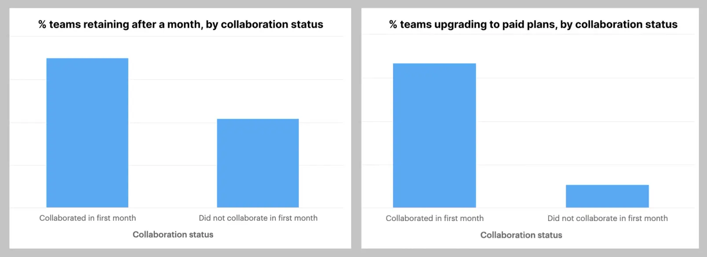

# [From experiment to launch: how data shaped a new comments experience | Figma Blog](https://www.figma.com/blog/from-experiment-to-launch-how-data-shaped-a-new-comments-experience/)

- insights about users and how they design together
- experiments: how to encourage feedback and collaboration directly in the file
- Teams that collaborate in their first month are 1.75x more likely to retain and 6.5x more likely to become a customer

- Since editors and viewers have access to share feedback on Figma files, we predicted that comments would be the front door to better collaboration across a team.
- While the data validated that comments are a strong indicator of team growth and engagement, we were surprised to learn that comments weren't widely used.
- Previously, users entered comments mode by clicking on an icon in the upper left corner of the Figma editor. A series of research sessions showed that, though comments provided value, users were struggling to find it within the product.
- To confirm whether low discoverability inhibited comments usage, we ran an experiment that prompted users to leave a comment. This initial test targeted developers with view-only access to a file—these users rely on close collaboration with designers in Figma, but were historically the least likely to interact with comments. After two weeks of experimentation at a 50/50 split, comment creation in the test group was 45% higher—without affecting the rate at which users returned to comments the following week. Simply making comments easier to discover had substantial impact on comments usage.
- After validating that comments were valuable but hard to find, we set out to help the product team find a more discoverable solution. For our second experiment, we thought that moving the entry point for comments from the left to the right side of the Figma menu bar would make it easier to find. While tools on the left offer core creation and canvas functionality for designers, we hypothesized that cross-functional partners might find themselves more frequently using the right side of the editor, where many of the collaboration and viewing features live. We ran the experiment with a 50/50 split on new users and tracked the percent of these users discovering comments within seven days of signing up. The results surprised us: we saw a 20% drop in comments discoverability across the board.

- See later: https://www.figma.com/blog/stay-in-the-flow-with-redesigned-comments/

# [How we use data | Figma Blog](https://www.figma.com/blog/how-we-use-data/)

During our background research, the data team found that **only 20% of users opened the share modal within the first month and only half of those users went on to successfully share a file.** We believed that the experience for potential sharers could be improved by simplifying the UI and moving secondary functions into separate tabs in the modal, making it easier to parse.

This experiment confirmed our hypothesis: **a simplified sharing experience would lead to more sharing activity. We saw a 2% increase in the percentage of users sending invites and a 2% increase in the number of users invited to each file.** We also didn’t see any regressions around the propensity for users to upload their work to the Figma Community, which was one of the metrics we thought could be impacted by this change.

At Config 2021, our annual design conference, we announced the beta of our new iOS app, which allows users to view and share files and prototypes on their mobile device. Following the announcement, the data team did a deep dive into crashes to understand how often they were occurring, under which scenarios, and on which platforms. In that analysis, they found that **prototypes were one of the primary drivers for crashes on iOS**, with 25% of prototypes crashes happening within the first 10 seconds of loading. They also confirmed our intuition—that crashes were more likely on more complex prototypes. These insights prompted a series of improvements involving different strategies around incremental frame loading and image sampling for prototypes. The resulting changes led to over a 50% reduction in prototype crash rates on iOS.
